# VYREALM architecture

```mermaid
flowchart LR
  UI[Electron / local browser studio] --> API[Authenticated loopback API]
  MCP[Optional stdio MCP bridge] --> API
  API --> DB[SQLite projects / revisions / assets / jobs]
  DB --> PLAN[Ollama director or labelled local plan]
  PLAN --> GATE[Model / CUDA / VRAM / disk preflight]
  GATE --> QUEUE[Durable jobs / shared GPU lease]
  QUEUE --> GEN[Managed ComfyUI / pinned Wan2.2 Q4]
  GEN --> KEY[Generated keyframe / locked reference]
  KEY --> I2V[Local image-to-video / saved frames]
  I2V --> PROOF[Provider history / hashes / frame lineage]
  PROOF --> REVIEW[Contact sheet / operator review]
  REVIEW --> EDIT[Editable timeline]
  MEDIA[Imported local media] --> EDIT
  AUDIO[Piper / Whisper / timed sound layers] --> EDIT
  EDIT --> RENDER[FFmpeg / captions / grade / measured audio]
  REVIEW --> UPSCALE[Tiled Real-ESRGAN / temporal detail stabilization]
  UPSCALE --> EDIT
  RENDER --> EXPORT[Verified MP4 / variants / project export]
  EXPORT --> DB
  GATE -->|Missing or unqualified| BLOCK[Blocked with diagnostic]
```

The existing renderer uses JavaScript/Vite, Node subprocess workers and SQLite. It has not been rewritten in Next.js. Electron starts the loopback server and owned local services. End users do not need development assistants or MCP.

One OS ownership lock protects each canonical project database. A shared per-user GPU lease prevents competing workers across workspaces. Completed stages retain workflow, provider IDs, frame ledgers and hashes. A changed project revision preserves completed results without silently replacing newer edits. Lost provider history for an incomplete stage blocks; complete retained evidence permits recovery without new inference.

Render provenance comes from server-owned asset/job records. Uploaded project JSON cannot certify local generation. Generated and enhanced inputs require recorded review before assembly. Primitive Blender scenes remain an explicitly abstract route, not a cinematic substitute.

Audio layers use project-owned local files with saved gain, trim, start and mute controls. The worker retains PCM masters and measures final AAC loudness/peaks. Transient-heavy mixes receive bounded correction passes; delivery failures remain explicit.

Onboarding pins bootstrap/code/model downloads and installs private Python environments. Settings provides install/resume and integrity checks. Prior configuration is retained. Full automatic update/rollback and a large-project archive format remain unfinished; JSON bundles have explicit size limits and reject incomplete media.

Windows source generation, editing and bootstrap setup have measured evidence. Updated desktop installation was blocked by automatic approval review. macOS and an externally disconnected installed-app test remain unverified. Lip-sync, diarization, 60 fps interpolation and automatic publishing are not connected.

