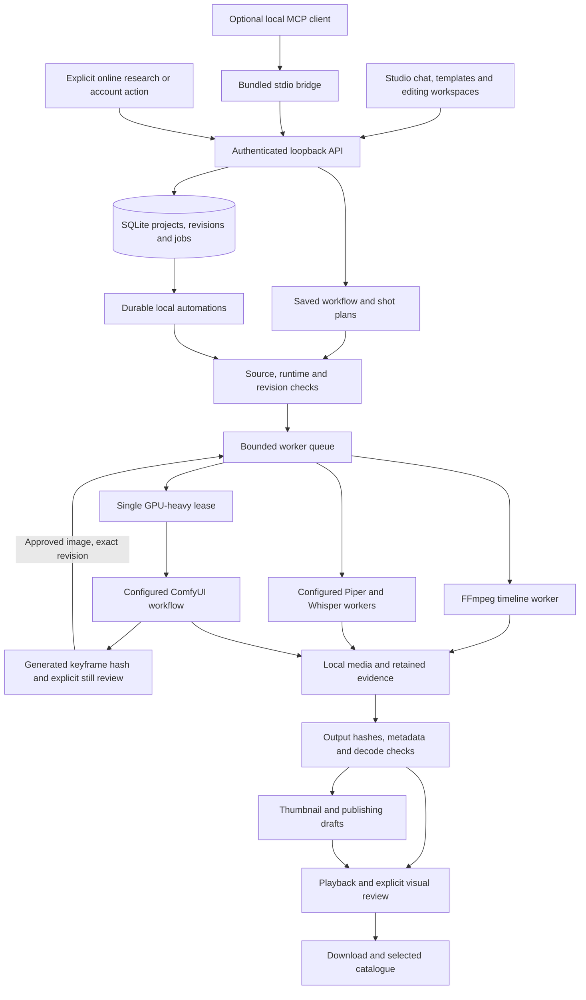

# VYREALM local production architecture

The shipped studio is a browser interface hosted by Electron and a loopback Node.js server. SQLite is the canonical project, revision, job and automation store. Media and verification artifacts live in local folders. Development assistants are not runtime dependencies.

## Production routes

**Uploaded footage:** import a local file, describe supported trim ranges in Studio chat or edit them in Timeline, save the project and render. The worker uses the saved canvas, source ranges, captions and audio layers. The exported file is recorded against its project revision and output hash. Imported footage stays labelled as imported or edited.

**Voice and captions:** Audio edits the narration script and timed transcript. Piper and Whisper run locally when configured. Their source text, model information and output artifacts are retained. Caption editing changes the project; an existing MP4 requires a new render to include the change.

In the current source checkout, Settings can install the CPU audio runtime into a private folder. Setup stages a configuration, checks model hashes and package versions, runs real narration/transcription, then atomically registers it. Existing configurations are retained; failed setup is not shown as installed. This source change has separate qualification from the published desktop checkpoint.

**Generated shots:** a configured provider must pass its dependency and generation checks. Its model, workflow, seed and output evidence remain separate from the final edited delivery. A blocked neural request does not become a successful Blender placeholder or a claim of native 4K generation. Local generation speed depends on the model and hardware; fast footage assembly does not establish fast neural generation.

The new **Original shots** route uses a separate shot brief, an owned keyframe subprocess, hash-bound still review and a separately admitted motion subprocess. A still approval does not start motion automatically. The shared GPU lease is released at the review boundary and reacquired for animation. Startup, cancellation and retries use service ownership; generic render controls cannot resubmit these jobs. A completed clip remains review-required. Current delivery is resized from a 1024×576 source; source and delivery have separate hashes. See [the original-shot MCP tools](MCP_ORIGINAL_SHOTS.md).

Brief provider-status failures reconnect to the exact retained prompt inside the same worker and lease. Reconnection cannot submit another graph or reset the original deadline. Explicit cancellation and exhausted recovery stop only the owned provider job. If reconnection interrupts peak-VRAM sampling, that full-job measurement is reported as unavailable.

Heavy-operation admission is serialized across setup and generation routes. Audio setup and raw-footage production wait while neural generation is active; raw admission is rechecked inside its save transaction. Reads, editing, saved-project updates and cancellation remain available. This admission rule does not imply that every model fits the machine's available RAM.

The desktop shell stores only the preferred loopback port and selected-project/workspace preferences outside browser localStorage. Main-process IPC accepts those bounded fields only from its own main-frame origin. A port collision can change the server port while preserving selection; projects and media remain in the same canonical SQLite store.

**Templates:** six starting workflows save an editable project and production plan. They do not create missing source media. Requirements and blocked operations remain visible.

## Saved automations

The current local automation is **render → verify → prepare creator materials → review**. It operates on an existing saved timeline. Each request has a durable identifier; restarting or retrying the same request does not create another render. A project revision change pauses affected work rather than silently rendering newer edits.

The scheduler runs while VYREALM is open. After reopening the same store, it resumes eligible work. It does not install an operating-system wake service. Cancellation applies to the workflow's own jobs. Completion means `needs-review`, with an actual video, verification result and draft creator materials; it does not mean approval or publication.

## Optional connections

The MCP screen shows the configuration for the actual bundled executable and stdio bridge. Its connection test initializes the protocol, lists tools and reads projects through the running local API. This verifies that route without generating media or publishing anything. Tool availability is reported separately from tools that remain blocked.

Online research is an explicit action with retained source evidence. YouTube account connection, private-upload code and analytics are separate from offline creation. Stored authorization does not prove an upload occurred. Account actions never become a dependency of local editing.

## Verification boundaries

- Unit and integration suites exercise admission, ownership, revisions, retries, source provenance and exports.
- Browser journeys exercise template creation, timeline editing, actual rendering, catalogue playback, MCP connectivity, scheduling, cancellation and downloads.
- FFmpeg decode and hash checks establish file integrity. They do not establish visual realism, audience response or subjective sound quality.
- Installation and platform claims require separate evidence from the installed build. Windows evidence does not qualify macOS or a fresh model installation.
- Reviewed showcase media are selected explicitly. Test patterns, unfinished drafts and rejected outputs are not catalogue films.
