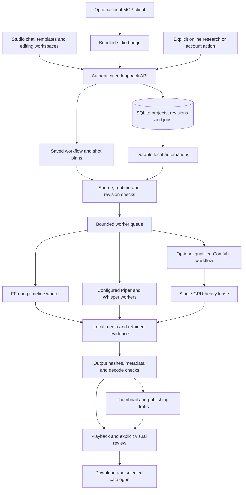

# VYREALM local production architecture

The shipped studio is a browser interface hosted by Electron and a loopback Node.js server. SQLite is the canonical project, revision, job and automation store. Media and verification artifacts live in local folders. Development assistants are not runtime dependencies.

## Production routes

**Uploaded footage:** import a local file, describe supported trim ranges in Studio chat or edit them in Timeline, save the project and render. The worker uses the saved canvas, source ranges, captions and audio layers. The exported file is recorded against its project revision and output hash. Imported footage stays labelled as imported or edited.

**Voice and captions:** Audio edits the narration script and timed transcript. Piper and Whisper run locally when configured. Their source text, model information and output artifacts are retained. Caption editing changes the project; an existing MP4 requires a new render to include the change.

**Generated shots:** a configured provider must pass its dependency and generation checks. Its model, workflow, seed and output evidence remain separate from the final edited delivery. A blocked neural request does not become a successful Blender placeholder or a claim of native 4K generation. Local generation speed depends on the model and hardware; fast footage assembly does not establish fast neural generation.

**Templates:** six starting workflows save an editable project and production plan. They do not create missing source media. Requirements and blocked operations remain visible.

## Saved automations

The current local automation is **render → verify → prepare creator materials → review**. It operates on an existing saved timeline. Each request has a durable identifier; restarting or retrying the same request does not create another render. A project revision change pauses affected work rather than silently rendering newer edits.

The scheduler runs while VYREALM is open. After reopening the same store, it resumes eligible work. It does not install an operating-system wake service. Cancellation applies to the workflow's own jobs. Completion means `needs-review`, with an actual video, verification result and draft creator materials; it does not mean approval or publication.

## Optional connections

The MCP screen shows the configuration for the actual bundled executable and stdio bridge. Its connection test initializes the protocol, lists tools and reads projects through the running local API. This verifies that route without generating media or publishing anything. Tool availability is reported separately from tools that remain blocked.

Online research is an explicit action with retained source evidence. YouTube account connection, private-upload code and analytics are separate from offline creation. Stored authorization does not prove an upload occurred. Account actions never become a dependency of local editing.

## Verification boundaries

- Unit and integration suites exercise admission, ownership, revisions, retries, source provenance and exports.
- Browser journeys exercise template creation, timeline editing, actual rendering, catalogue playback, MCP connectivity, scheduling, cancellation and downloads.
- FFmpeg decode and hash checks establish file integrity. They do not establish visual realism, audience response or subjective sound quality.
- Installation and platform claims require separate evidence from the installed build. Windows evidence does not qualify macOS or a fresh model installation.
- Reviewed showcase media are selected explicitly. Test patterns, unfinished drafts and rejected outputs are not catalogue films.
